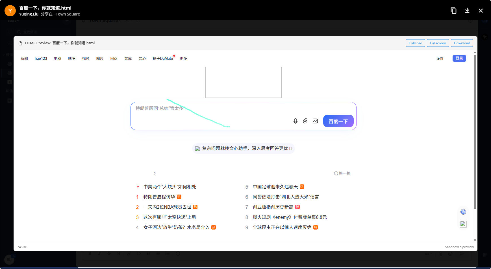

# Mattermost HTML Preview Plugin

A Mattermost plugin that enables inline preview of HTML files directly in the message interface.


## Features

- Inline HTML file preview in message threads
- Sandboxed iframe rendering for security
- Expandable preview window
- One-click download button
- File size information display
- Theme-aware styling

## Requirements

- Mattermost Server 10.0.0 or higher
- Node.js 16+ and npm

## Installation

### Build from source

1. Clone this repository:
   ```bash
   git clone <repository-url>
   cd mattermost-plugin-html-preview
   ```

2. Install dependencies and build:
   ```bash
   make dist
   ```

3. Upload the plugin to Mattermost:
   - Go to **System Console** > **Plugins** > **Management**
   - Click **Upload Plugin** and select `dist/com.mattermost.html-preview-1.0.0.tar.gz`
   - Or use mmctl:
     ```bash
     mmctl plugin add dist/com.mattermost.html-preview-1.0.0.tar.gz
     ```

4. Enable the plugin in **System Console** > **Plugins** > **Plugin Management**

### Manual installation

1. Build the plugin:
   ```bash
   make dist
   ```

2. Create a tarball:
   ```bash
   cd dist && tar -czf ../com.mattermost.html-preview-1.0.0.tar.gz .
   ```

3. Upload via System Console or mmctl

## Configuration

After installation, configure the plugin in **System Console** > **Plugins** > **HTML Preview**:

| Setting | Description | Default |
|---------|-------------|---------|
| Enable Sandbox Mode | Render HTML in sandboxed iframe for security | true |
| Maximum File Size (KB) | Max HTML file size to preview | 1024 |

## Usage

1. Upload an HTML file to a channel
2. The file will automatically show an inline preview
3. Click **Expand** to see the full content
4. Click **Download** to download the original file

## Security

- HTML files are rendered in a sandboxed iframe with `allow-scripts allow-same-origin`
- Scripts can run but cannot access parent window or navigate
- External resources may still load; review untrusted HTML files carefully

## Development

### Directory structure

```
html-preview/
├── plugin.json           # Plugin manifest
├── assets/               # Plugin icon
│   └── icon.svg
├── webapp/               # Web app source
│   ├── src/
│   │   ├── index.js      # Plugin entry point
│   │   └── components/
│   │       └── HtmlPreview.jsx  # Preview component
│   ├── package.json
│   ├── webpack.config.js
│   └── .babelrc
├── Makefile
└── README.md
```

### Development workflow

1. Start webpack in watch mode:
   ```bash
   cd webapp && npm run dev
   ```

2. Enable plugin development mode in Mattermost config:
   ```json
   {
     "PluginSettings": {
       "DeveloperMode": true
     }
   }
   ```

3. Copy the webapp bundle to your Mattermost plugins directory:
   ```bash
   cp webapp/dist/main.js /path/to/mattermost/plugins/com.mattermost.html-preview/webapp/dist/
   ```

## License

MIT License
